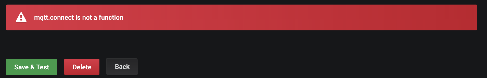
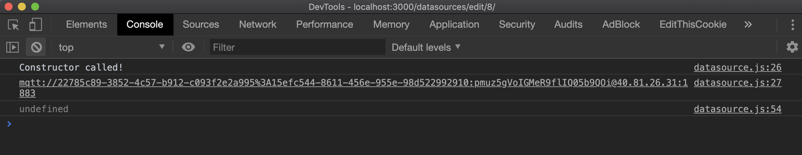

# 開發目的

想實現一個 data source plugin，可以直接透過 ``mqtt`` 連接 IoT Hub 並接收訊息。目的是在提供 demo 給客戶時，甚至是 PoC 階段，可以不用透過資料庫或其他後端伺服器獲取數據，而是直接透過 ``mqtt message`` 接收數據，藉此快速產生應用範例，並且因為不需要讀寫資料庫，進而增加數據顯示的效率。

# 開發完成後之使用方式
1. 使用者只要在 data source 輸入 IoT Hub 連線資訊，例如 ``mqtt uri``。
2. 點擊 ``Save & Test`` 按鈕測試與 IoT Hub 之連線。
3. 新增 Panel 之後，在 edit mode 選擇此 data source。
4. 在 editor 頁面中輸入想要訂閱的 ``topic``。
5. panel 開始接收從這個 ``topic`` 收到的訊息，也就是即時數據，並呈現在 panel 上。

# 遇到的問題

實作方式是拿官方的 [simple-json-datasource](https://github.com/grafana/simple-json-datasource) 做修改，以下為遇到的問題。

## 導入 mqtt 依賴項之問題

由於直接使用 npm module 導入的方式，在 grafana 架構中不適用，查了[這個討論串](https://github.com/grafana/simple-json-datasource/issues/19)，做如下的修改，便沒有導入的問題。

### 1. 安裝 mqtt

```
npm install mqtt
```


### 2. 新增 external 資料夾

- 在 ``src`` 資料夾中新增 ``external`` 資料夾
- 從 ``node_modules/mqtt/dist`` 中將 ``mqtt.js`` 與 ``mqtt.min.js`` 複製到上述 ``external`` 資料夾


### 3. 修改 Gruntfile

- 新增了 ``copy:externals`` 任務
- 取消 ``mochaTest`` 

```js
module.exports = function (grunt) {

  require('load-grunt-tasks')(grunt);

  grunt.loadNpmTasks('grunt-execute');
  grunt.loadNpmTasks('grunt-contrib-clean');

  grunt.initConfig({

    clean: ["dist"],

    copy: {
      src_to_dist: {
        cwd: 'src',
        expand: true,
        src: ['**/*', '!**/*.js', '!**/*.scss'],
        dest: 'dist'
      },
      pluginDef: {
        expand: true,
        src: ['README.md'],
        dest: 'dist'
      },
      externals: {
        cwd: 'src',
        expand: true,
        src: ['**/external/*'],
        dest: 'dist'
      }
    },

    watch: {
      rebuild_all: {
        files: ['src/**/*'],
        tasks: ['default'],
        options: { spawn: false }
      }
    },

    babel: {
      options: {
        sourceMap: true,
        presets: ['es2015']
      },
      dist: {
        options: {
          plugins: ['transform-es2015-modules-systemjs', 'transform-es2015-for-of']
        },
        files: [{
          cwd: 'src',
          expand: true,
          src: ['**/*.js'],
          dest: 'dist',
          ext: '.js'
        }]
      },
      distTestNoSystemJs: {
        files: [{
          cwd: 'src',
          expand: true,
          src: ['**/*.js'],
          dest: 'dist/test',
          ext: '.js'
        }]
      },
      distTestsSpecsNoSystemJs: {
        files: [{
          expand: true,
          cwd: 'spec',
          src: ['**/*.js'],
          dest: 'dist/test/spec',
          ext: '.js'
        }]
      }
    },
    mochaTest: {
      test: {
        options: {
          reporter: 'spec'
        },
        src: ['dist/test/spec/test-main.js', 'dist/test/spec/*_spec.js']
      }
    }
  });

  // grunt.registerTask('default', ['clean', 'copy:src_to_dist', 'copy:pluginDef', 'copy:externals', 'babel', 'mochaTest']);
  grunt.registerTask('default', ['clean', 'copy:src_to_dist', 'copy:pluginDef', 'copy:externals', 'babel']);
};

```

### 4. 導入 mqtt

_datasource.js_
```js
import * as mqtt from './external/mqtt';

...

```

<br>

## 驗證導入後是否可使用

- 在 ``datasource.js`` 中的 ``GenericDatasource`` class 中的 constructor 加入 ``this.mqttUri``。

```js
export class GenericDatasource {

  constructor(instanceSettings, $q, backendSrv, templateSrv) {
    // MQTT URI
    this.mqttUri = 'mqtt://22785c89-3852-4c57-b912-c093f2e2a995%3A15efc544-8611-456e-955e-98d522992910:pmuz5gVoIGMeR9flIQ05b9QOi@40.81.26.31:1883';

    ...

    console.log(this.mqttUri);

    // 為理解 constructor 何時會被呼叫
    console.log('Constructor called!');
    

  }

  ...

```

<br>

- 在 `` testDatasource()`` 中加入連線 mqtt 的程式碼。

```js
testDatasource() {

    console.log(mqtt.connect);  // 會印出 undefined

    // MQTT: connect and subscribe
    let client = mqtt.connect(this.mqttUri);
    client.on('connect', function () {
      client.subscribe('temp', function (err) {
        if (!err) {
          console.log('subscribed successfully.');
          // client.publish('temp', 'Hello mqtt');
        } else {
          console.log(err);
        }
      });
    });

    return this.doRequest({
      url: this.url + '/',
      method: 'GET',
    }).then(response => {
      if (response.status === 200) {
        return { status: "success", message: "Data source is working", title: "Success" };
      }
    });
  }


```

<br>

## 執行結果

點擊 ``Save & Test`` 按鈕，會彈出 ``mqtt.connect is not a function`` 的錯誤訊息。



<br>

在 Chrome inspect tool 中 Console 則顯示以下訊息。



- ``constructor called`` 表示點擊 ``Test & Save`` 時，constructor 會被呼叫。
- ``mqttUri`` 有正常被設定。
- 嘗試印出 ``mqtt.connect``，但顯示為 ``undefined``。
